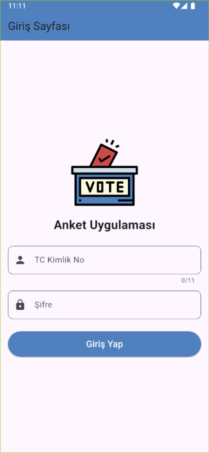
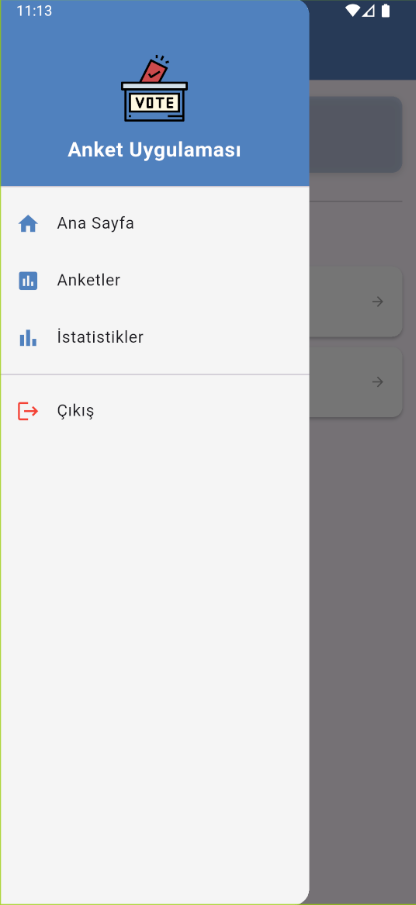
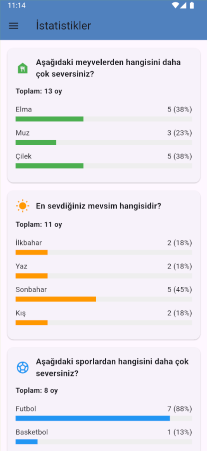

# Anket Uygulaması (Vote App)

Bu proje, kullanıcıların TC kimlik numaralarıyla giriş yapıp çeşitli anketlere katılabilecekleri ve anket sonuçlarını görüntüleyebilecekleri bir mobil uygulamadır. Flutter ile geliştirilmiş, kullanıcı dostu arayüzü ile herkesin kolayca kullanabileceği bir yapıda tasarlanmıştır.

## Uygulama Özellikleri

- TC kimlik numarası doğrulama ile güvenli giriş
- Farklı kategorilerde anketler
- Her kullanıcının her ankete sadece bir kez oy verebilmesi
- Anket sonuçlarının gerçek zamanlı görüntülenmesi
- Kullanıcı oturum bilgilerinin güvenli şekilde saklanması

## Ekran Görüntüleri

### 1. Giriş Sayfası

- **Görev**: Kullanıcıların uygulamaya giriş yapmalarını sağlar
- **İçerik**:
  - TC kimlik numarası doğrulama (11 hane ve ilk rakam 0 olmamalı)
  - Şifre alanı (güvenlik için gizli metin, en az 4 karakter)
  - Giriş yapma butonu
  - Uygulama logosu
---

### 2. Ana Sayfa

- **Görev**: Kullanıcıya temel navigasyon ve özet bilgi sağlar
- **İçerik**:
  - Kullanıcı bilgilerini gösteren kart (TC kimlik numarasının gizlenmiş hali)
  - Anketler ve İstatistikler sayfalarına hızlı erişim butonları
  - Kolay kullanım için açıklamalı menü öğeleri

---

### 3. Drawer Menü

Uygulamanın yan menüsünde (Drawer) kullanılan logo, Flaticon API'sinden alınmıştır:
- **Logo URL**: https://cdn-icons-png.flaticon.com/512/1902/1902201.png
- **Kaynak**: Flaticon ücretsiz ikonlar
- **Kullanım**: Drawer başlığında ve giriş sayfasında uygulamanın markalaşması için kullanılmıştır

---

### 4. Anketler Sayfası

- **Görev**: Kullanıcıların anketlere katılmasını sağlar
- **İçerik**:
  - Mevcut anketlerin listesi (meyve tercihi, mevsim tercihi, spor tercihi gibi)
  - Her anket için seçenekler
  - Kullanıcının oy durumu (daha önce oy kullanmış mı)
  - Oy verildikten sonra sonuçların görüntülenmesi
  - Her kullanıcının her ankete sadece bir kez oy verebilmesi

---

### 5. İstatistikler Sayfası

- **Görev**: Anket sonuçlarını görselleştirir
- **İçerik**:
  - Her anketin toplam oy sayısı
  - Her seçeneğin aldığı oy sayısı ve yüzdesi
  - Görsel ilerleme çubukları
  - Seçeneklerin popülerliğini gösteren grafiksel gösterimler

---

## Login Bilgilerinin Saklanması

Kullanıcı giriş bilgileri şu şekilde saklanır ve yönetilir:

1. **SharedPreferences Kullanımı**:
   - TC kimlik numarası, uygulamanın yerel depolama alanında `'user_id'` anahtarı ile saklanır
   - Şifre güvenlik nedeniyle saklanmaz, sadece giriş sırasında minimum gereklilikleri doğrulanır

2. **Oturum Yönetimi**:
   - Kullanıcı giriş yaptığında, TC kimlik numarası cihazda saklanır
   - Uygulama içinde diğer sayfalara geçişlerde bu bilgi kullanılır

3. **Oy Verme Kayıtları**:
   - Her kullanıcının her ankette kullandığı oylar, `'selectedOption_${userId}_$surveyIndex'` formatında benzersiz anahtarlarla yerel olarak saklanır
   - Bu sayede bir kullanıcının aynı ankete birden fazla oy vermesi engellenir

---

## Grup Üyelerinin Projeye Katkısı

|     Üye Adı     |   Numara  |                    Katkı                     |
|-----------------|-----------|----------------------------------------------|
| Yusuf Erdoğdu   | 030122046 | Login Ekranı, Anket sayfası ve veri yönetimi |
| Furkan Yılmaz   | 030122034 | İstatistik sayfası ve veri yönetimi          |
| Metehan Beyaz   | 030122029 | Anasayfa, Drawer ve görsel bileşenler        |

---

## Diğer Özellikler

### Kod Organizasyonu
- **lib/screens/**: Uygulama sayfaları (login_page.dart, home_page.dart, survey_page.dart, statistics_page.dart)
- **lib/widgets/**: Tekrar kullanılabilir widget'lar (custom_drawer.dart)
- **lib/main.dart**: Uygulama başlangıç noktası ve rota tanımları
